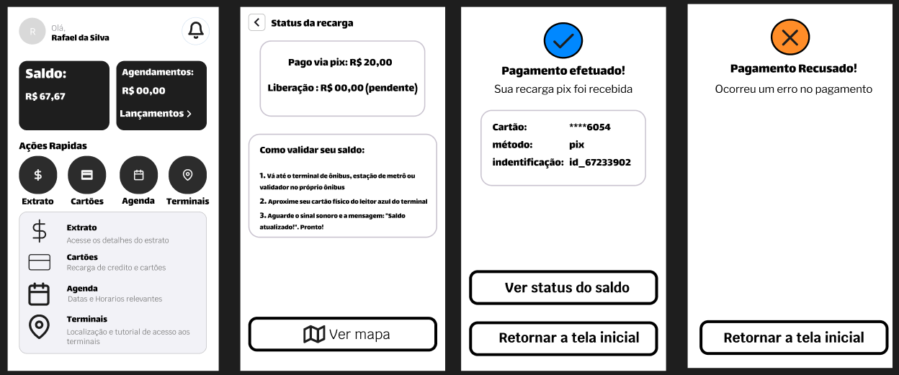
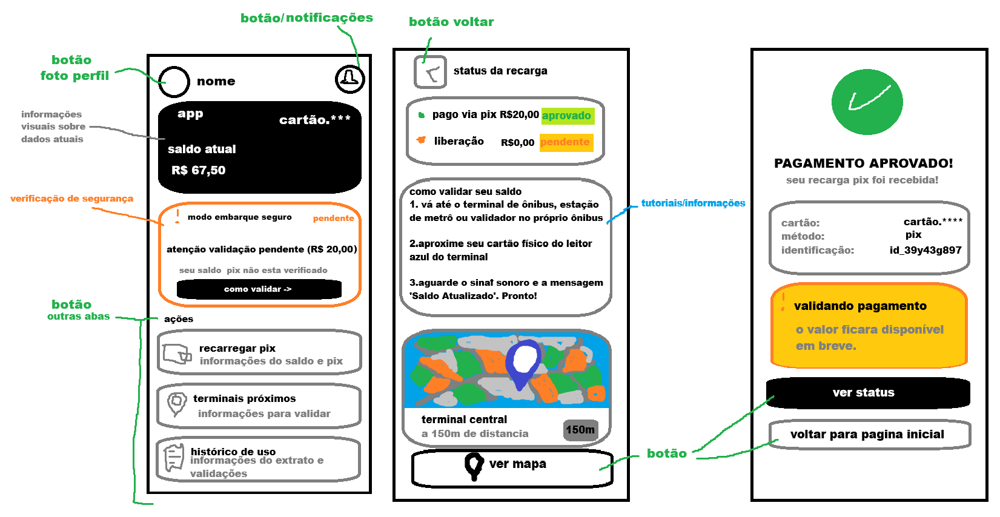
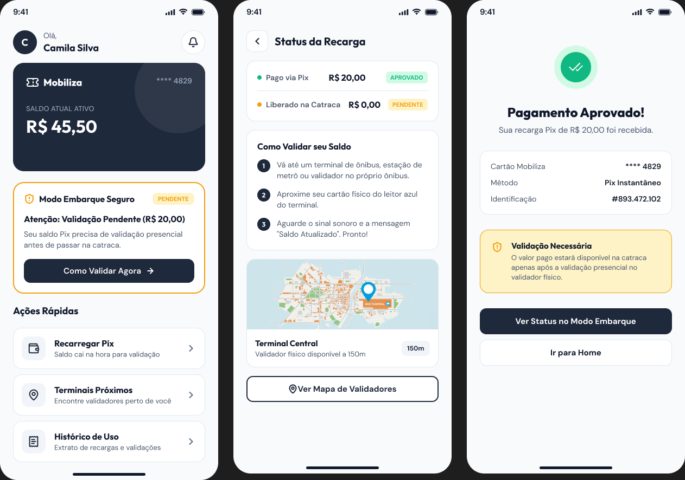

# Atividade 03 — 🎨 Design de Interface, Hierarquia Visual e Acessibilidad
## 🎯 Objetivo da Atividade

Aplicar os fundamentos de Interação Humano-Computador (IHC), psicologia do olhar (hierarquia visual) e diretrizes de acessibilidade universal (WCAG) na criação dos rascunhos de tela e protótipo inicial no Figma para a solução **Modo Embarque Seguro**.

---

## 👁️ 1. Hierarquia Visual e Psicologia do Olhar

O fluxo da tela principal foi desenhado respeitando os padrões de varredura visual (**Padrão F/Z**) para direcionar a atenção do usuário no menor tempo possível, ideal para a persona no ponto de ônibus:

*   **Ponto Focal Primário (Onde o olho bate primeiro):** O indicador de status do cartão (*"Pronto para Embarcar"* ou *"Validação Pendente"*). Utilização de um card em destaque na parte superior central com alto contraste.
*   **Ponto Focal Secundário:** O saldo ativo real formatado em tipografia de grande porte (ex: 32pt bold) para leitura instantânea.
*   **Ponto Focal Terciário (Ação de Suporte):** Botões operacionais (*"Como Validar Agora"*, *"Recarregar via Pix"*) posicionados na área de alcance fácil dos polegares (*Thumb Zone*).
*   **Carga Cognitiva Reduzida:** Eliminação de elementos decorativos desnecessários na tela de embarque para evitar distrações em momentos de pressa.

---

## ♿ 2. Princípios de Acessibilidade Aplicados (WCAG & IHC)

Para garantir que o aplicativo seja funcional para todas as pessoas — incluindo cegos, daltônicos e pessoas com limitações motoras —, foram incorporadas as seguintes diretrizes:

### Acessibilidade para Daltônicos e Baixa Visão
*   **Design Multimodal (Além da Cor):** O status do cartão não utiliza apenas verde/amarelo. É acompanhado de ícones distintos (Ex: 🟢 Checkmark para Liberado, 🟡 Placa de Alerta para Pendente) e texto explicativo claro em caixa alta.
*   **Contraste Tipográfico:** Taxa de contraste mínimo de 4.5:1 entre o texto e o fundo (seguindo norma WCAG AA), garantindo leitura sob luz solar direta no ponto de ônibus.

### Acessibilidade para Deficientes Visuais (Cegos)
*   **Suporte a Leitores de Tela (TalkBack / VoiceOver):** Telas estruturadas com rótulos descritivos (*aria-label*) na sequência lógica de leitura.
*   **Feedback Sonoro e Háptico:** Confirmação da checagem do status por vibração do aparelho e sinais sonoros diferenciados para status "Pronto" ou "Pendente".

### Ergonomia e Acessibilidade Motora
*   **Área de Toque (Touch Targets):** Todos os botões e áreas clicáveis possuem tamanho mínimo de **48x48 dp**, evitando cliques acidentais por usuários com tremores ou em movimento.
*   **Thumb Zone:** Ações principais concentradas no terço inferior da tela, facilitando a navegação com apenas uma das mãos.

---

## 🖼️ 3. Protótipo e Estrutura de Interface (Figma)

*   **Link do Projeto no Figma:** https://www.figma.com/design/zcPdz7HdkHwqBTMyjZun4Y/Sem-t%C3%ADtulo?node-id=0-1&t=aKaRutMajQcNRQXA-1

### Telas Mapeadas no Protótipo
| Tela | Função Principal | Elemento de Acessibilidade em Destaque |
|---|---|---|
| **01. Home / Embarque Seguro** | Exibir status do cartão e saldo real em 1 segundo. | Card de alto contraste + suporte a leitor de tela. |
| **02. Detalhes de Validação** | Instruir o usuário sobre como ativar o saldo pendente. | Ícones indicativos + mapa simplificado de alta legibilidade. |
| **03. Fluxo de Recarga Expressa** | Realizar o Pix e exibir o rastreio da carga. | Botões amplos e padrão multimodal de confirmação. |

---

## 🖼️ Prints da Interface

